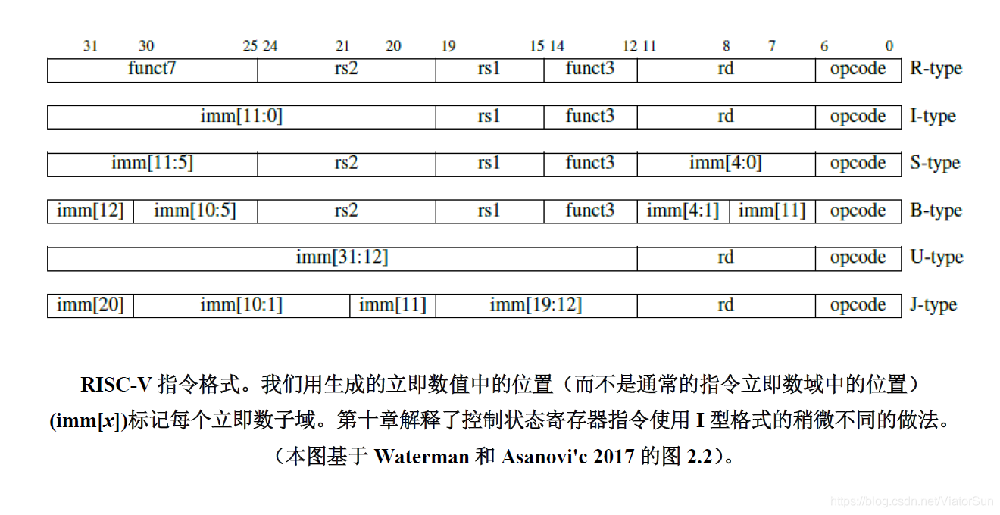
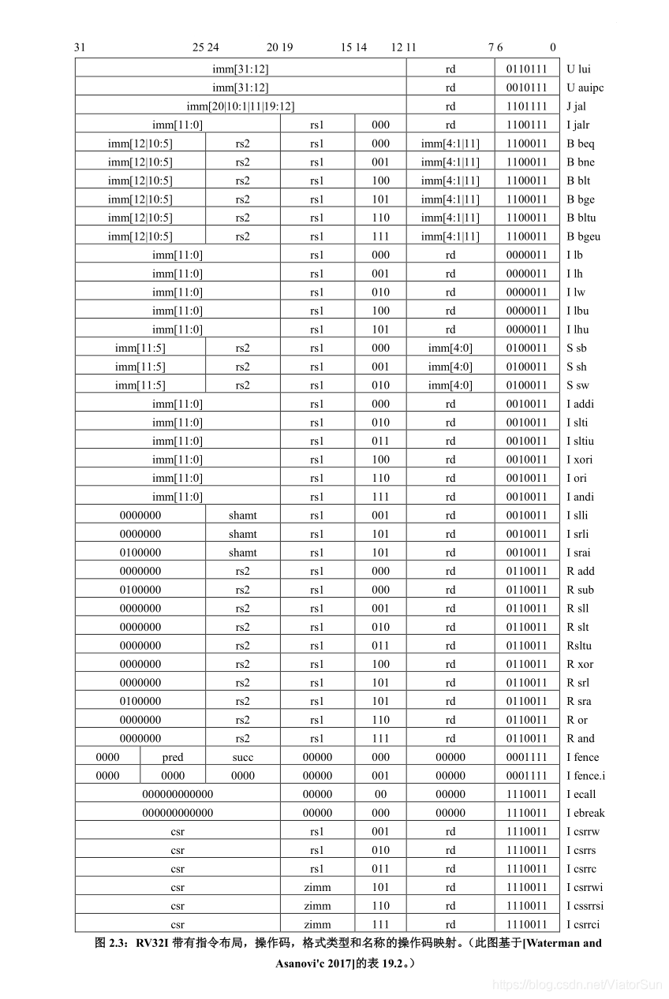

# CPU Design

## 关于RISC-V指令集

类型：

- R-Type：用于寄存器 - 寄存器操作；
- I-Type： 用于短立即数和load操作
- S-Type：用于Store操作
- B-Type：条件跳转操作
- U-Type：用于长立即数操作
- J-Type：用于无条件跳转操作

指令格式图：

## 1.memory_controller

每个模块只能控制输出，不能控制输入

可能会发生冲突，可能会有 IF 和 LS_EX 同时来的请求。

但是同一类的指令（比如说 instruction fetch）不会连续进入memCtrl因为IF中记录了一个状态：如果memCtrl在处理它发出的一个请求，那么在这个请求结束之前IF不会再向memCtrl发出instruction fetch的请求。

## 2. IF阶段

只有 hit 并且 global_full_signal == false 时才往下传 inst

设置两个状态一个 idle 表示空闲，一个 busy 表示正在从 memCtrl 中获取inst；

- [ ] 处理写内存操作使得Icache中的指令与mem中不一样的情况。
- [ ] 处理由于非阻塞赋值导致无法实现同时将当前pc传给dispatcher和改变pc

## 3.ID阶段

### 先写一个小的decoder

作用：解析出指令的 Type，rs1, rs2, rd, imm。

需要在constant文件中对37条指令进行编号0-37(0表示nop指令)

根据 opcode、func3、func7能够区分出所有的指令类型